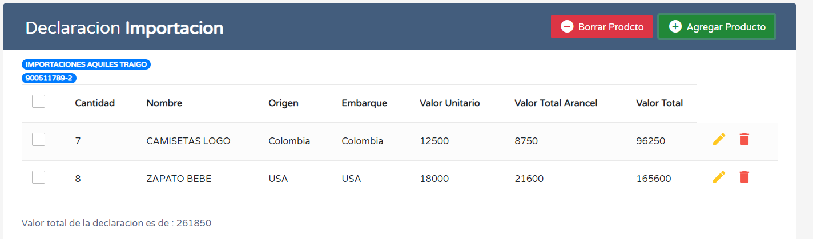
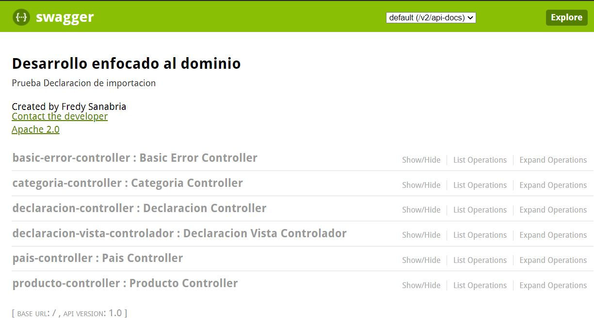
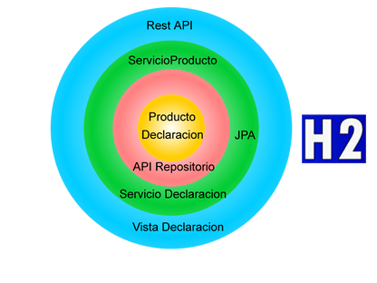

# DeclaracionImportacion
 Esta aplicacion permite crear una declaracion de importacion
 
 
 
 Está desarrollada siguiendo DDD (Desarrollo enfocado a dominio) usando técnicas como TDD y mejores prácticas como principios SOLID.
 
  * Como correr esta aplicación:
     - 
       El proyecto se debe construir usando Maven (utilice el siguiente comando), en el directorio principal, donde se encuentra el archivo pom.xml
       ```
       mvn package
       ```
       Para correr la aplicación desde linea de comandos usted puede correr el siguiente comando java.
       Este jar ejecutable se encuentra donde la aplicación fue empaquetada.
       
       ```
       java -jar target/propuesta-0.0.1-SNAPSHOT.jar
       ```       
  * Documentarion y APIS URL:
     - 
 

   Desde acá puede consultar todas las API creadas
       
   ```
   http://localhost:8081/swagger-ui.html
   ```
   Además cuenta con una pagina donde puede consultar las declaraciones creadas y agregarles productos.
       
   ```
   http://localhost:8081/vistaDeclaraciones?id=200
   ```       

 * Tecnologias:
    - 
     
    
  + FrontEnd
        Es una página html basada en jquery and Bootstrap 
  + BackEnd
  Son varias API desarrolladas con Java 8, usando el framework SpringBoot, JPA-hibernate hacia una base de datos en memoria H2,
  además se utilizó swagger 2 para la documentacion de las API.
  
    
             

