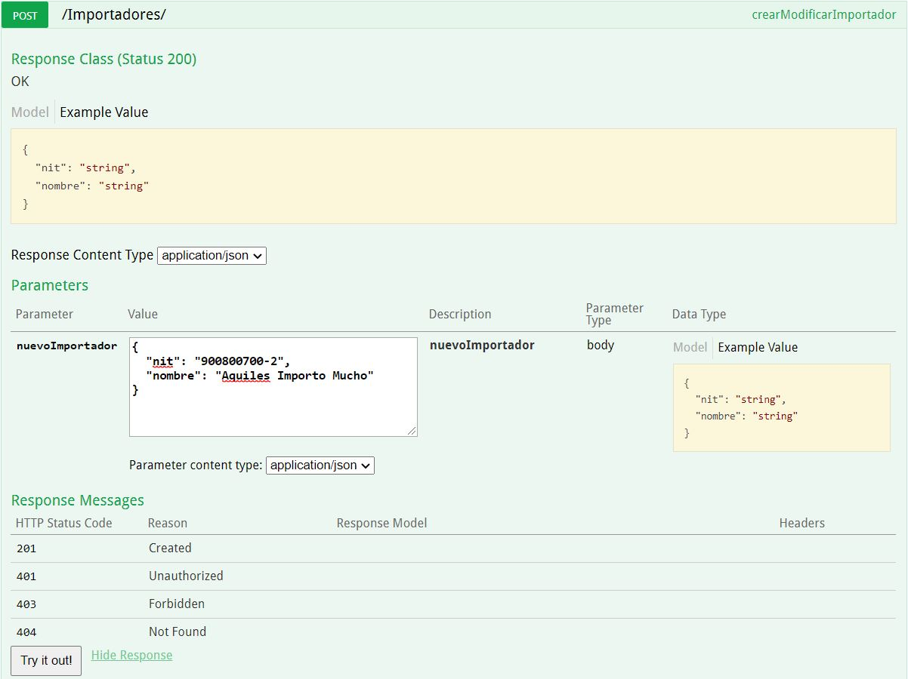
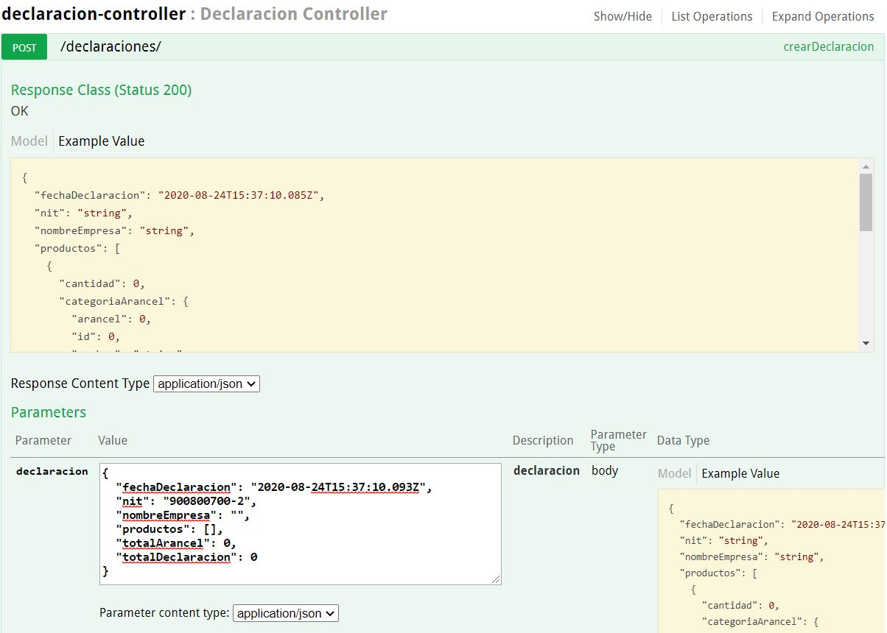

# DeclaracionImportacion
 Esta aplicacion permite crear una declaracion de importacion
 
 
 
 Está desarrollada siguiendo DDD (Desarrollo enfocado a dominio) usando técnicas como TDD y mejores prácticas como principios SOLID.
 
  * Como correr esta aplicación:
     - 
       El proyecto se debe construir usando Maven (utilice el siguiente comando), en el directorio principal, donde se encuentra el archivo pom.xml
       ```
       mvn package
       ```
       Para correr la aplicación desde linea de comandos usted puede correr el siguiente comando java.
       Este jar ejecutable se encuentra donde la aplicación fue empaquetada.
       
       ```
       java -jar target/propuesta-0.0.1-SNAPSHOT.jar
       ```       
  * Documentarion y APIS URL:
     - 
 

   Desde acá puede consultar todas las API creadas
       
   ```
   http://localhost:8081/swagger-ui.html
   ```
   Además cuenta con una pagina donde puede consultar las declaraciones creadas y agregarles productos.
       
   ```
   http://localhost:8081/vistaDeclaraciones?id=200
   ```       

 * Tecnologías:
    - 
     
    
  + FrontEnd
        Es una página html basada en jquery and Bootstrap 
  + BackEnd
  Son varias API desarrolladas con Java 8, usando el framework SpringBoot, JPA-hibernate hacia una base de datos en memoria H2,
  además se utilizó swagger 2 para la documentacion de las API.
  
 * Flujo Funcionalidad Básica:
    - 
    Existe data precargada para la declaracion con consecutivo 200, para agregar una nueva declaracion
    debemos utilizar el API de declaraciones y el API para Importadores
   ```
   http://localhost:8081/swagger-ui.html
   ``` 
    Primero creamos la empresa de importacion con un nit y un nombre:
 
     
    Con el nit creado podremos crear la plantilla para la declaracion de importacion con los productos vacios
 
      
    Con el consecutivo de declaracion creado podremos adicionar productos usando la direccion:
   ```
   http://localhost:8081/vistaDeclaraciones?id=***
   ``` 
donde *** es el ID de la declaracion anteriormente creada.     

 * Otras API:
    - 
    La aplicacion cuenta con otras API para la generacion de Paises, Categorias de arancel, sobre las cuales
    se realizan calculos en la declaracion asi como tambien validaciones en el caso de paises vetados.   